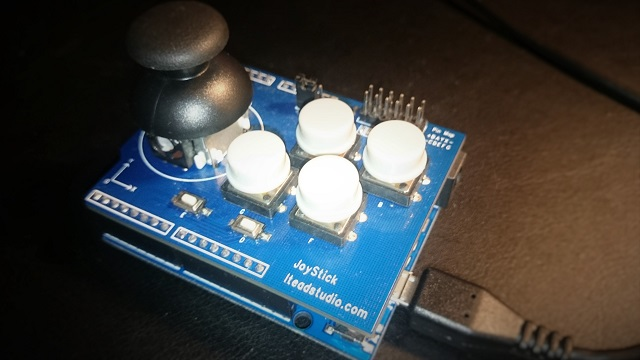

# serial-arduino-gamepad
This sketch sends all keypresses given by an arduino-gamepad-shield over a serial-connection to the pc.
If you want to use an arduino-uno with is not able to emulate an keyboard directly, you can use this sketch and
the python script from this [https://github.com/thomas-rager/python-gamepad-keyboard] repository to emulate keypresses under linux.

I created this sketch to use my arduino uno with a gamepad-shield form iteadstudio. The 'gamepad' is used as
controller for my mini-arcade-cabinet based on an rasperry-pi 2 with emulation-station.

---

**Author:** Thomas Rager
